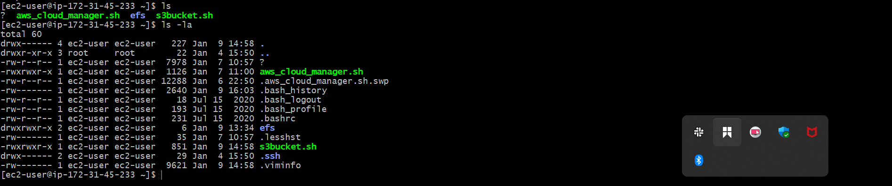
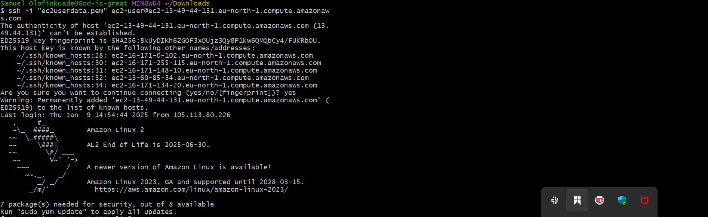
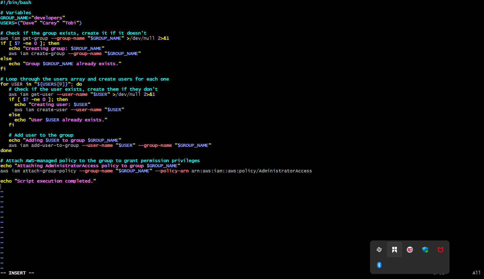
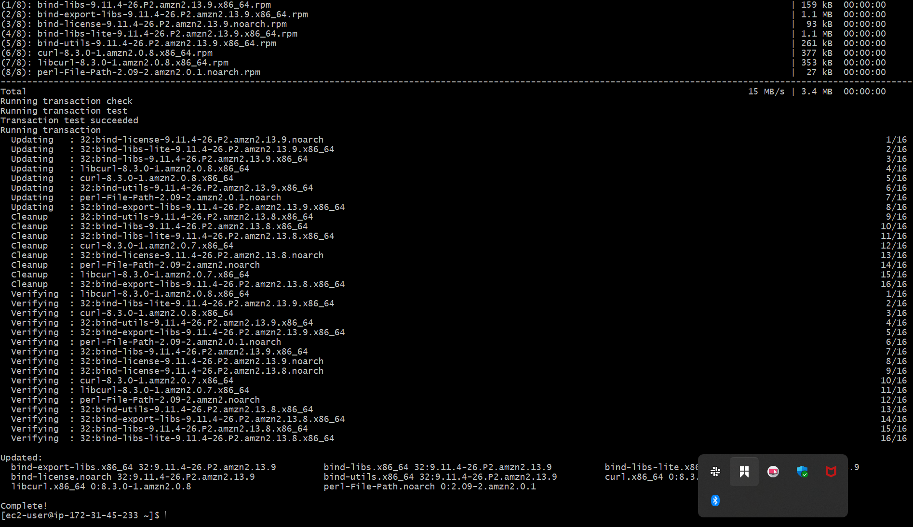

# CAPSTONE PROJECT: SHELL SCRIPT FOR AWS IAM Management

This script automates the process of creating IAM (Identity and Access Management) users, creating an IAM group, adding users to the group, and attaching an AWS-managed policy (AdministratorAccess) to the group. The script is intended for administrators managing AWS IAM resources and simplifies the process of setting up users and groups with specific permissions.

>> Features
Group Creation: Checks if a specified IAM group exists and creates it if it doesn't.
User Creation: Loops through a list of users, checks if each exists, and creates them if necessary.
User Group Association: Adds each user to the specified IAM group.
Policy Attachment: Attaches the AdministratorAccess AWS-managed policy to the specified group, granting administrative permissions to all users in that group.
Prerequisites

The AWS CLI must be installed and configured with the necessary permissions to manage IAM resources (e.g., iam:CreateUser, iam:GetUser, iam:AddUserToGroup, iam:CreateGroup, iam:AttachGroupPolicy).
The script must be executed by a user with sufficient IAM privileges to manage IAM groups, users, and policies.
The script assumes that users will be added to an IAM group called developers, but this can be adjusted as needed.

Script Breakdown

1. Variables Section
bash

GROUP_NAME="developers"
USERS=("Dave" "Carey" "Tobi")
GROUP_NAME: Specifies the IAM group to which the users will be added. In this case, it's set to "developers".
USERS: An array of IAM users ("Dave", "Carey", and "Tobi") to be created and added to the group.

2. Group Existence Check and Creation
bash

aws iam get-group --group-name "$GROUP_NAME" >/dev/null 2>&1
if [ $? -ne 0 ]; then
   echo "Creating group: $GROUP_NAME"
   aws iam create-group --group-name "$GROUP_NAME"
else
   echo "Group $GROUP_NAME already exists."
fi
The script first checks if the IAM group (specified in the $GROUP_NAME variable) exists using the aws iam get-group command.
If the group does not exist ($? -ne 0), it creates the group using aws iam create-group.
If the group already exists, a message is displayed confirming its existence.

3. User Creation and Group Association
bash

for USER in "${USERS[@]}"; do
   aws iam get-user --user-name "$USER" >/dev/null 2>&1
   if [ $? -ne 0 ]; then
     echo "Creating user: $USER"
     aws iam create-user --user-name "$USER"
   else
     echo "User $USER already exists."
   fi

   echo "Adding $USER to group $GROUP_NAME"
   aws iam add-user-to-group --user-name "$USER" --group-name "$GROUP_NAME"
done

>> This loop iterates over the USERS array and performs the following for each user:
It checks if the user exists using aws iam get-user.
If the user does not exist ($? -ne 0), the script creates the user using aws iam create-user.
If the user already exists, it moves on to the next step without making changes.
After ensuring the user exists, the script adds the user to the specified IAM group ($GROUP_NAME) using the aws iam add-user-to-group command.

4. Policy Attachment to the Group
bash

echo "Attaching AdministratorAccess policy to group $GROUP_NAME"
aws iam attach-group-policy --group-name "$GROUP_NAME" --policy-arn arn:aws:iam::aws:policy/AdministratorAccess
This step attaches the AdministratorAccess AWS-managed policy to the IAM group. The policy ARN (arn:aws:iam::aws:policy/AdministratorAccess) grants full administrative privileges to all users in the group.
The aws iam attach-group-policy command is used to attach the policy to the group.

5. Completion Message
bash

echo "Script execution completed."
Once the group and users are created, and the policy is attached, this message is displayed to indicate the script has finished executing.

>> Error Handling
The script uses $?, the exit status of the last command, to check if an operation was successful or not:
If a command like aws iam get-group or aws iam get-user fails (i.e., the group or user does not exist), the script proceeds to create the resource.
The exit status ($?) is checked immediately after each AWS CLI command to decide whether to create a resource or skip the action.

Example Output
bash

Creating group: developers
Creating user: Dave
Adding Dave to group developers
Creating user: Carey
Adding Carey to group developers
Creating user: Tobi
Adding Tobi to group developers
Attaching AdministratorAccess policy to group developers
Script execution completed.
This output would indicate that the script:
Successfully created the group developers.
Created users Dave, Carey, and Tobi.
Added all users to the developers group.
Attached the AdministratorAccess policy to the group.

# Additional Notes
Custom Group Names: You can easily change the group name by modifying the GROUP_NAME variable.
Custom Users: The list of users is stored in the USERS array, and can be expanded or altered as needed.
Policy Customization: You can replace the AdministratorAccess policy with any other AWS-managed or custom IAM policy by changing the --policy-arn value.

# Potential Improvements
Error Logging: The script could be enhanced by adding logging functionality, so errors can be recorded in a file for auditing or debugging.
Input Validation: The script assumes all AWS CLI commands succeed. It might be helpful to add more checks or log errors if a command fails.
Interactive Input: Instead of hardcoding the USERS and GROUP_NAME, these could be passed as arguments to the script for more flexibility.

# Conclusion
This script simplifies the process of managing IAM users, groups, and policies in AWS by automating common administrative tasks. By running this script, an administrator can efficiently create users, assign them to a group, and configure group-level permissions, saving time and reducing the chance of human error.

# Below are relevant screenshots of how the project was executed.

Thank you.
